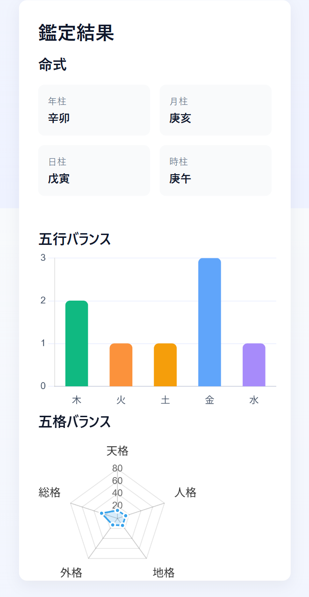
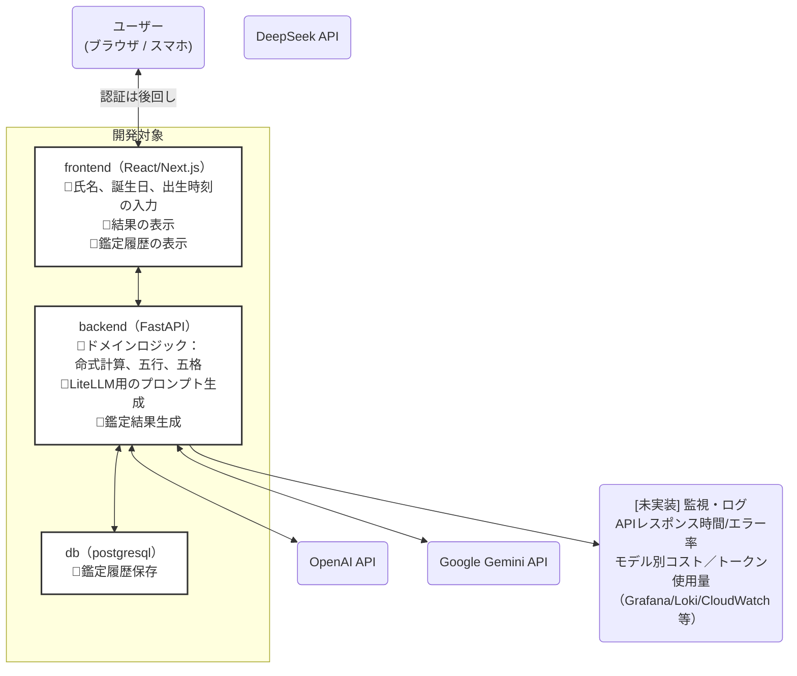

# 🌟四柱推命と姓名判断から人生のブループリントを読み解くアプリ (MVP)

# 概要
四柱推命と姓名判断からあなたの人生のブループリントを読み解くアプリです。
「名前」、「生まれた年月日時」を入力すると命式、五行、五格が計算されて大まかな人生の流れが表示されます。
算出は一般的なものを更に簡略化しています。
AI駆動開発の練習用です。認証、厳密なバリデーション、ログ監視などは未実装です。

### 画面イメージ





# 構成
コンテナは以下のような構成です
- frontend: node, react, next
- backend: python, fastapi
- db: poatgresql




## 設定方法

### Google サービスアカウント 設定
```bash
mkdir -p ./secrets
cp /path/to/your-google-service-account.json ./secrets/google-service-account.json
chmod 400 ./secrets/google-service-account.json
```

### コンテナ起動、マイグレーション
```bash
# from repo root
docker compose up --build -d

# DBのマイグレーション
PYTHONPATH=./backend python backend/manage_migrate.py # テーブル作成
psql "$DATABASE_URL" -f backend/migrations/kanji_data.dump.sql # "$DATABASE_URL"はご自身の環境に合わせて修正してください

# frontend: http://localhost:3000
# backend: http://localhost:8000


```

### 開発環境用ツールのインストール
- リンター、コードフォーマッター
```
pip install -r dev-requirements.txt
```


## 漢字の画数DBについて
漢字の画数は[漢字画数データベース](https://kanji-database.sourceforge.net/database/strokes.html)からダウンロードさせていただきました。

- ファイル：backend/migrations/ucs-strokes.txt,v
- 漢字画数インポート方法
  `PYTHONPATH=./backend python backend/import_kanji.py`


