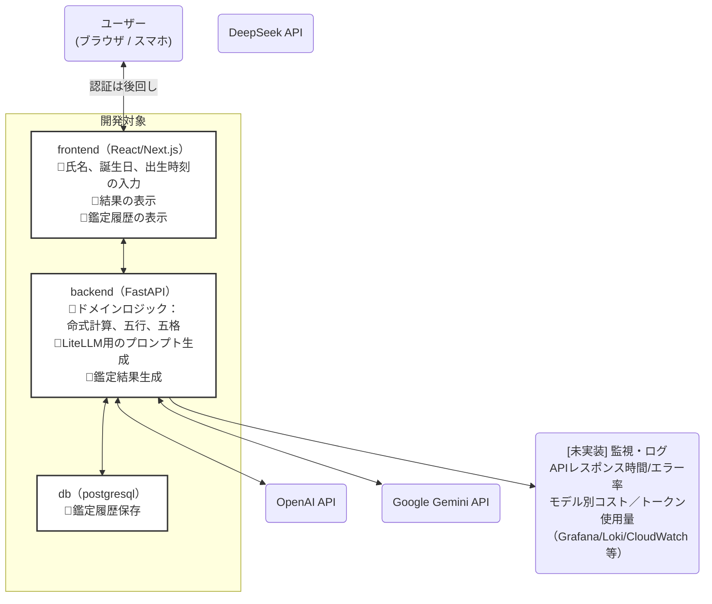

# 🌟四柱推命と姓名判断から人生のブループリントを読み解くアプリ (MVP)

# 概要
四柱推命と姓名判断からあなたの人生のブループリントを物語風に読み解くアプリです。

「名前」、「生まれた年月日時」を入力すると命式、五行、五格が計算されて大まかな人生の流れが桃源郷の旅路を模した物語で表現されます。

算出は一般的なものを更に簡略化しています。算出した値からLLMで鑑定文を作成します。

AI駆動開発の練習用です。
認証、厳密なバリデーション、ログ監視などは未実装です。


### 画面イメージ


# 構成
コンテナは以下のような構成です
- frontend: node, react, next
- backend: python, fastapi
- db: poatgresql




## 設定方法

### APIキー 設定
1. [Google AI Studio](https://aistudio.google.com/)でAPI keyを取得してください。
2. REPOルートの`.env.sample`を`.env`にファイル名変更
3. `GEMINI_API_KEY=`に `1.` で取得したキーをコピーして貼り付けます

### コンテナ起動、マイグレーション
```bash
# from repo root
docker compose up --build -d

# DBのマイグレーション
PYTHONPATH=./backend python backend/manage_migrate.py # テーブル作成
# "$DATABASE_URL"はご自身の環境に合わせて修正してください
psql "$DATABASE_URL" -f backend/migrations/kanji_data.dump.sql # 漢字データ

```
### ブラウザアクセス

`http://localhost:3000`
で画面が表示されます

### LLMのモデル

鑑定文作成とサマリ作成で使用するモデルを分けています。
- 鑑定文作成： gemini-2.5-flash
- サマリ作成： gemini-2.5-flash-lite

鑑定文は表現力が必要なので、`gemini-2.5-pro`やOpenAIの`GPT-4o`のようなモデルがおすすめです。この環境では無料枠があるgemini-2.5-flashを使用しています。
サマリ作成は表現力が問われないので、`gemini-2.5-flash-lite`のような軽くて安価なモデルがよいです。

プロンプトも[鑑定文](backend/app/services/prompts/template_life_analysis.py)と[サマリ](backend/app/services/prompts/template_life_analysis_summary.py)で分けています


### 開発環境用ツールのインストール
- リンター、コードフォーマッターを使用しています

```
pip install -r dev-requirements.txt
```

### TEST
テストコマンド

テスト内で `DEBUG_LITELLM_FAKE_RESP=1`としてlitellmの呼び出しをパスします
```bash
docker compose exec frontend npm test -- --coverage --coverageDirectory=coverage --coverageReporters=text
docker compose exec backend bash -c "PYTHONPATH=/app pytest"
```

### debug
uvicornとsqlalchemyのdebugを有効化
```bash
docker compose -f docker-compose.yml -f docker-compose.override.yml up --build
```

## 漢字の画数DBについて
漢字の画数は[漢字画数データベース](https://kanji-database.sourceforge.net/database/strokes.html)からダウンロードさせていただきました。

- ファイル：backend/migrations/ucs-strokes.txt,v
- 漢字画数インポート方法
  `PYTHONPATH=./backend python backend/import_kanji.py`


