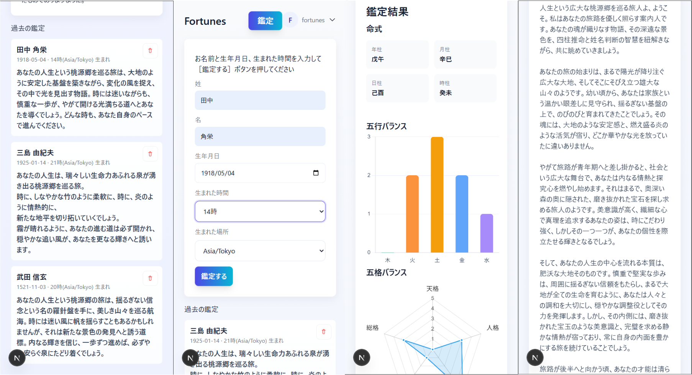
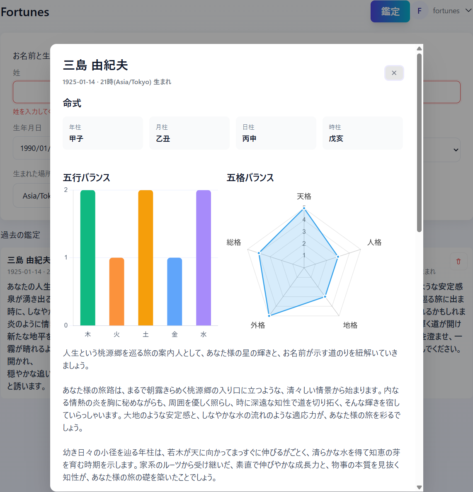
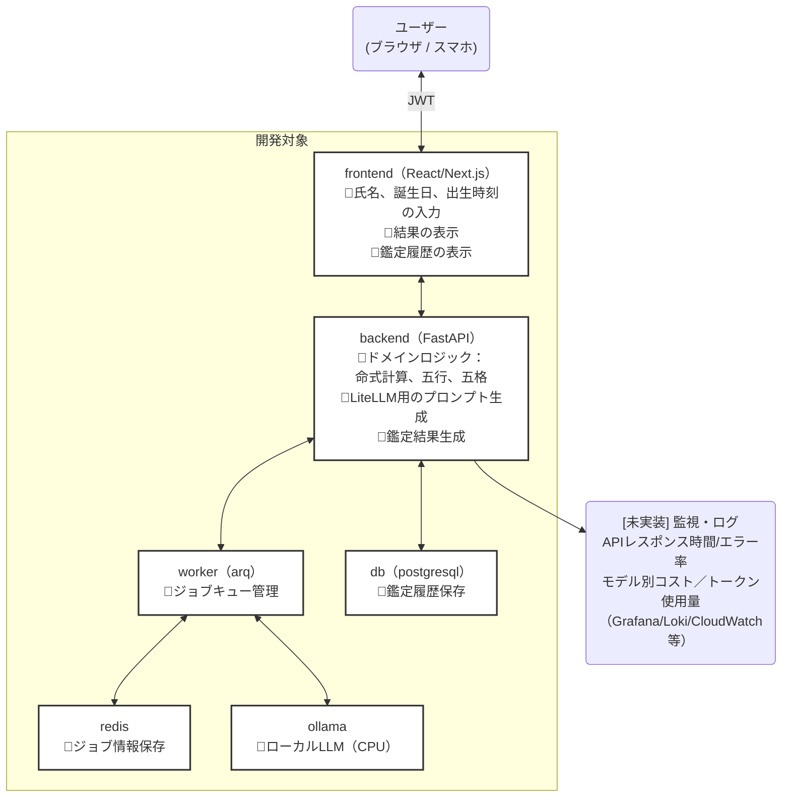

[](https://github.com/plaodas/fortunes/actions/workflows/frontend-tests.yml) [](https://github.com/plaodas/fortunes/actions/workflows/backend-tests.yml)

# 🌟四柱推命と姓名判断から人生のブループリントを読み解くアプリ (MVP)

## 概要
四柱推命と姓名判断からあなたの人生のブループリントを物語風に読み解くアプリです。

「名前」、「生まれた年月日時」を入力すると命式、五行、五格が計算されて大まかな人生の流れが桃源郷の旅路を模した物語で表現されます。

算出は一般的なものを更に簡略化しています。算出した値からLLMで鑑定文を作成します。

AI駆動開発の練習用として不慣れなPython／FastAPI、React/Next.jsで作成しています。

ログ監視などは未実装です。


### 画面イメージ





## 構成
コンテナは以下のような構成です
- frontend: node, react, next
- backend: python, fastapi
- worker: python, arq
- ollama: ローカル LLM（CPU）
- redis: redis
- db: poatgresql


```mermaid
flowchart TD
  %% ノード定義
  user("`ユーザー
    (ブラウザ / スマホ)
  `")
  subgraph 開発対象
    frontend["`frontend（React/Next.js）
      🔵氏名、誕生日、出生時刻の入力
      🔵結果の表示
      🔵鑑定履歴の表示
    `"]
    backend["`backend（FastAPI）
      🔵ドメインロジック：
        命式計算、五行、五格
      🔵LiteLLM用のプロンプト生成
      🔵鑑定結果生成
    `"]
    worker["`worker（arq）
      🔵ジョブキュー管理
    `"]
    redis["`redis
      🔵ジョブ情報保存
    `"]
    db["`db（postgresql）
      🔵鑑定履歴保存
    `"]
    ollama["`ollama
      🔵ローカルLLM（CPU）
    `"]
  end
  monitor("`[未実装] 監視・ログ
    APIレスポンス時間/エラー率
    モデル別コスト／トークン使用量
    （Grafana/Loki/CloudWatch等）
  `")

  user <-->|JWT| frontend
  frontend <--> backend
  backend <--> worker
  worker <--> redis
  backend <--> db
  backend --> monitor
  worker <--> ollama

  %% 幅を指定するクラス定義（pxで指定）

  classDef wideCard stroke:#333,stroke-width:1px
  class * wideCard
  classDef dev fill:#fff,stroke:#333,stroke-width:2px,width:400px;text-align:center
  class frontend,backend,worker,redis,db,ollama dev

```


## 設定方法

### ローカルLLM（Ollama）
鑑定文は Compose 内の Ollama で生成します。API キーは不要です。

1. REPOルートの`.env.sample`を`.env`にファイル名変更
2. 既定モデルは `qwen3.5:9b`（量子化でおよそ 6〜8GB）。メモリが足りないときは `.env` の `OLLAMA_MODEL=qwen3.5:4b` に変える
3. 下の `docker compose up` で `ollama-pull` がモデルを取得してから worker が起動する

モデルを手動で取り直す場合:

```bash
docker compose exec ollama ollama pull qwen3.5:9b
```

### コンテナ起動、マイグレーション
.envの値を適宜変更したら、以下のコマンドを実行します。
wsl(ubuntu)の場合
```bash
# from repo root
docker compose up --build -d

# DBのマイグレーション
./scripts/init_db.sh
```

`./scripts/init_db.sh` はホストの `psql` と `pg_restore` を `localhost:5432` に向けます。Ubuntu では `postgresql-client` に入っています。

```bash
sudo apt install postgresql-client
```

`db` コンテナは PostgreSQL 15 です。`backend/migrations/kanji.dump` はアーカイブ形式 1.15 なので、コンテナ内の `pg_restore` では読めません。ホストのクライアントも 15 以前のときは、公開ポートへ PostgreSQL 17 の `pg_restore` で戻します。

```bash
docker run --rm --network host -e PGPASSWORD=password \
  -v "$PWD/backend/migrations:/dump:ro" \
  postgres:17 \
  pg_restore -h 127.0.0.1 -U postgres -d fortunes \
  --clean --no-owner --no-privileges -v /dump/kanji.dump
```

先頭の `SET transaction_timeout = 0;` は PostgreSQL 15 に無いパラメータです。`errors ignored on restore: 1` が出ても、テーブル作成とデータの投入はその後に完了します。

このダンプの `kanji` 定義に `strokes_kangxi` はありません。`--clean` のあと、康熙画数を入れます。

```bash
docker compose exec backend bash -lc "PYTHONPATH=/app python /app/import_kangxi.py"
```

PostgreSQLのlocale：ja_JP.UTF-8、futuresデータベースの collationも'ja_JP.UTF-8'で指定。
誕生日時は内部でUTCとして保存し、指定されたtimezoneに戻して返しています。


### ブラウザアクセス

`http://localhost:3000`
で画面が表示されます

user: **fortunes**
password: **fortunes33**

### メールキャッチャー (開発用)
開発用にメールキャッチャーを立ち上げています。
新規登録のメール認証は以下のURLでアクセスできます。
http://localhost:8025/

<!-- ### 開発: 同一オリジンでの API プロキシ (推奨)

開発中は Next.js のリライトでフロントとバックエンドを同一オリジンに見せる構成を推奨します。これによりブラウザの Cookie / CSRF 挙動がシンプルになり、認証まわりのデバッグが容易になります。

- 仕組み (このリポジトリの例):
  - `frontend/next.config.js` の `rewrites` で `/api/:path*` をバックエンドにプロキシしています。
  - `docker-compose.yml` では開発用に `API_PROXY_TARGET` を `http://backend:8000` に設定しています。
  - フロント側の API 呼び出しは相対パス（例: `/api/v1/auth/login`）を使います。

- 利点:
  - SameSite / Secure によるクロスサイトの制約を回避できるため、`HttpOnly` なクッキーを使った認証が容易になります。
  - ブラウザの `credentials: 'include'` と組み合わせて、`access_token` クッキーが正しく送信されます。

- 注意点（本番移行時）:
  - 本番では Traefik などでパスベースのルーティング（`example.com` の `/api` をバックエンドにリバースプロキシ）を設定して同一オリジンを実現するのが望ましいです。
  - サブドメイン構成（`app.example.com` と `api.example.com`）にする場合は `NEXT_PUBLIC_API_BASE` のようにフロントに API ベース URL を渡し、`SameSite=None; Secure` と HTTPS を必ず有効にしてください。

開発手順（素早く試す）:
```bash
# 起動（リポジトリルート）
docker compose up --build -d

# Frontend は Next の proxy を使うので、フロントで相対パスで呼び出すだけでOK
# 例: POST /api/v1/auth/login の後に GET /api/v1/auth/me を呼ぶ
```

セキュリティ注意: 開発中に `HttpOnly` を外したり、`SameSite=None` を無条件で付けると XSS/CSRF リスクが高まるため、本番では適切に HTTPS と `Secure` を有効にしてください。 -->


### 開発環境用ツールのインストール
- リンター、コードフォーマッターを使用しています
pre-commitでコミット時に実行するので、ホストOSで以下のコマンドを実行してインストールしてください。Cursor のコミットもこのフックを通ります。チェックは CI と同じで、`ruff format`、`isort`、`black` の順です。
```
pip install -r backend/dev-requirements.txt
pre-commit install
```

## その他・メモ
### TEST

テストコマンド

```bash
docker compose exec frontend npm test -- --coverage --coverageDirectory=coverage --coverageReporters=text
docker compose exec backend bash -c "PYTHONPATH=/app pytest"
```

### debug
uvicornとsqlalchemyのdebugを有効化
```bash
docker compose -f docker-compose.yml -f docker-compose.override.yml up --build
```

### LLMのモデル

鑑定文は Ollama の 1 モデルを 1 回だけ呼んで作ります。履歴用の短いサマリは、その詳細文の先頭段落を 150 文字で切ったものです。

- 既定モデル: `qwen3.5:9b`（`OLLAMA_MODEL`）
- 接続先: `http://ollama:11434`（`OLLAMA_API_BASE`）。LiteLLM が `ollama/<model>` として呼びます
- 詳細文の目標は 600〜800 文字です。プロンプトは[鑑定文](backend/app/services/prompts/template_life_analysis.py)

メモリが足りないときは `OLLAMA_MODEL=qwen3.5:4b` にして、`docker compose up -d` で pull し直します。


## 永続運用
<!-- ### 運用(systemd)： -->
 <!-- Service Unit (推奨): docker compose プロジェクト全体を systemd で管理するのが簡単で堅牢 -->
<!-- ```
[Unit]
Description=Fortunes Docker Compose
After=docker.service
Requires=docker.service

[Service]
Type=oneshot
RemainAfterExit=yes
WorkingDirectory=/home/agake/work/fortunes
ExecStart=/usr/bin/docker compose up -d
ExecStop=/usr/bin/docker compose down
TimeoutStartSec=0

[Install]
WantedBy=multi-user.target
``` -->
<!-- 個別コンテナ管理: もし worker のみ永続化したければ ExecStart=/usr/bin/docker compose up -d worker を使う。
注意: ユーザー単位で動かす場合は user-level systemd も可。systemd の Restart= ポリシーや StartLimitBurst で再起動制御。 -->

### ログ
- ローテーション
  - `docker-compose.yml`の`logging:`で設定
<!-- 集中ログ基盤: Loki/Promtail, ELK (Elasticsearch/Logstash/Kibana), Fluentd/Graylog などへ送るのが推奨（検索とアラートが容易）。
エラートラッキング: Sentry を導入して例外トレースを収集。Worker/Server に SDK を入れるだけでOK。
ログ保持方針: 法令や容量に合わせて保管期間を決め、古いログは圧縮/削除。 -->

<!-- ### 監視（メトリクス・アラート）: -->

<!-- メトリクス収集: Prometheus + Grafana。アプリ側に /metrics を公開（FastAPI に prometheus_client または fastapi-prometheus を導入）。
重要な指標:
job queue length（Redis の待ち行列長）
job failure rate / error count（Worker）
job processing time（遅延検出）
Redisメモリ使用率、Postgres接続数、CPU/メモリコンテナリソース
サンプルアラート（PromQL）:
job失敗率 > 1% (5m)
Redis memory > 80%
job処理時間の95パーセンタイル > 30s
可視化: Grafana ダッシュボードでSLA指標と最近の失敗を表示。 -->

### ヘルスチェック / Liveness & Readiness:
 FastAPI に /health （Liveness）と /ready （Readiness 、DB・Redis接続チェック）を追加。Kubernetes での運用や systemd 側の監視で使う。


<!-- ### トレーシング & 分析: -->

<!-- 分散トレーシング: OpenTelemetry + Jaeger（LLM呼び出しや DB クエリの遅延調査に有効）。
サンプル: opentelemetry-instrumentation-fastapi を導入して自動計測。 -->

### 永続データ管理 / バックアップ:
```bash
# バックアップ backupディレクトリにfortunes-ooooooooooooooo.dumpで保存
scripts/backup_fortunes.sh

# レストア
scripts/restore_fortunes.sh backup/fortunes-ooooooooooooooo.dump
```
<!-- Postgres バックアップ: 定期的な pg_dump / WAL アーカイブ。自動化スクリプト + S3 などへの保存。
DB マイグレーション管理: alembic 等でスキーマ管理とリリース手順を確立。 -->

<!-- ### 運用オペレーション（通知・Runbook）: -->

<!-- アラート通知: Slack/Email/PagerDuty へ通知（Grafana/Alertmanager 経由）。
Runbook: 代表的問題（Redis接続切断、LLM APIキー切れ、DB接続枯渇）の復旧手順を文書化。
監査ログ: 主要操作（設定変更・deploy・DB restore）の記録。 -->

<!-- ### セキュリティ・設定管理: -->

<!-- 秘密管理: 環境変数を直接置かず Vault / AWS Secrets Manager 等で管理。
アクセス制御: DB/Redis のネットワークアクセスは内部ネットワークに限定。 -->


## その他
### (参考)ジョブのキュー管理 Arq backendコンテナで確認する
```bash
$ docker compose exec backend bash -lc "PYTHONPATH=/app  python -m app.worker"

07:57:07: Starting worker for 1 functions: app.tasks.process_analysis
07:57:07: redis_version=7.4.7 mem_usage=1.01M clients_connected=1 db_keys=0


$ curl -X POST http://localhost:8000/analyze/enqueue \
  -H "Content-Type: application/json" \
  -d '{"name_sei":"太","name_mei":"郎","birth_date":"1990-01-01","birth_hour":12, "birth_tz":"Asia/Tokyo", "sex":"male"}'
```


## 漢字の画数DBについて
五格は康熙画数で計算します。現代の画数（最小・最大）とは別です。

- 現代画数: [漢字画数データベース](https://kanji-database.sourceforge.net/database/strokes.html) の `backend/migrations/ucs-strokes.txt,v`
  `PYTHONPATH=./backend python backend/import_kanji.py`
- 康熙画数: [Unicode Unihan](https://www.unicode.org/Public/UCD/latest/ucd/Unihan.zip) の `kRSUnicode`（康熙部首番号）に部首画数を足したもの。`backend/migrations/kangxi-strokes.txt`
  `PYTHONPATH=./backend python backend/import_kangxi.py`

字が無い、または康熙画数が無い姓名は鑑定を受け付けません。大運には性別（`sex`: `male` / `female`）が必要です。

